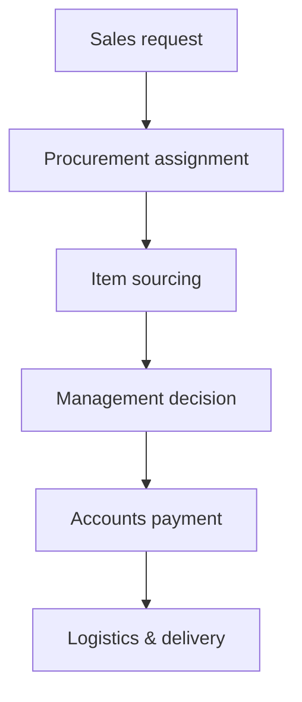
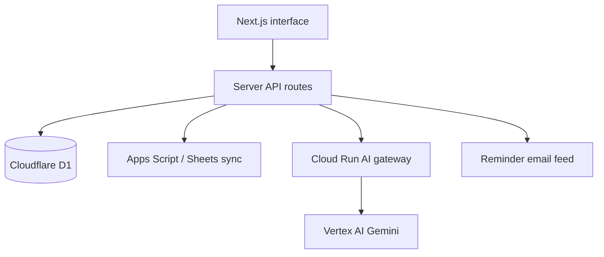

# OrderFlow

<p align="center">
  
</p>

<p align="center">
  A full-stack, multi-department order workflow platform—from request intake to customer delivery.
</p>

> Portfolio edition: company identities, customer data, deployment IDs, service URLs, and credentials have been replaced with fictional examples.

## Why I built it

Operational orders often move through Sales, Procurement, Management, Accounts, and Logistics in separate spreadsheets and message threads. That makes ownership, item-level ETAs, approvals, and late deliveries difficult to see.

OrderFlow gives every department one role-aware workspace while maintaining a shared, item-level order history.

## What it does

- Captures **BOM**, **Stock Request**, and **Customer Order** workflows with color-coded identification.
- Creates orders manually or imports structured data from Excel and PDF files.
- Uses Gemini to extract editable order drafts, calculate item delivery dates from lead times, and include VAT in unit pricing.
- Assigns individual line items to procurement owners.
- Records supplier, cost, source link, purchase order, ETA, and procurement notes per item.
- Fetches a product price from a pasted public supplier link through a protected Gemini gateway.
- Lets management approve a source or select a replacement supplier without restarting the workflow.
- Moves approved items through payment, receiving, dispatch, and delivery.
- Keeps order-level comments and a permanent cross-department history.
- Generates filtered annual CSV reports for administrators.
- Prepares clean department reminder emails for scheduled automation.
- Enforces server-side roles for Sales, Procurement, Management, Accounts, Logistics, and Admin users.

## Workflow



Every line item progresses independently, so a single order can contain items at different stages and with different delivery dates.

## Architecture



| Layer | Technology |
|---|---|
| UI | Next.js, React, TypeScript, Tailwind CSS |
| API | Next.js route handlers on Cloudflare Workers |
| Database | Cloudflare D1 with Drizzle ORM |
| AI | Gemini via a secret-protected Google Cloud Run gateway |
| Import/export | PDF, Excel, CSV |
| Optional integration | Google Sheets through Apps Script |
| Authentication | Hosting-provided identity headers plus server-side role checks |

## Security design

- Secrets stay in runtime environment settings and are never sent to the browser.
- Administrative, departmental, and mutation permissions are checked again on the server.
- The public supplier-link feature rejects private-network URLs and unsupported protocols.
- The Gemini gateway accepts only approved models and tools, verifies a shared secret, limits request size, and uses its Google Cloud service identity.
- AI prompts treat uploaded documents, links, comments, and order fields as untrusted content.
- The portfolio repository contains no production database, webhook, customer record, or credential.

See [SECURITY.md](SECURITY.md) for repository security guidance.

## Local setup

### Requirements

- Node.js 22 or newer
- pnpm 11

### Install and build

```bash
cp .env.example .env.local
corepack enable
pnpm install --frozen-lockfile
pnpm build
```

### Initialize the local D1 database

After the first build, apply the included SQL migrations in filename order:

```bash
for migration in drizzle/*.sql; do
  node --import ./scripts/sites-env.mjs ./node_modules/wrangler/bin/wrangler.js \
    d1 execute DB --local --config dist/server/wrangler.json \
    --persist-to .wrangler/state --file "$migration"
done
```

Then start the development server:

```bash
pnpm dev
```

Open `http://localhost:5173/signin-with-chatgpt?return_to=/` to use the local mock identity supplied by the development adapter.

## Environment variables

Copy `.env.example` to `.env.local` and configure only the services you want to test. Never commit `.env.local` or real credentials.

The application can run with manual order entry alone. Gemini, Sheets synchronization, and reminder automation are optional integrations.

## Repository map

```text
app/                    UI and API routes
components/             Reusable interface components
db/                     Drizzle schema and D1 access
drizzle/                Ordered SQL migrations
lib/                    Access, Gemini, and Sheets helpers
cloud-run-gateway/      Protected Vertex AI gateway
scripts/                Local build/runtime helpers
```

## Portfolio case study

Read [PORTFOLIO_CASE_STUDY.md](PORTFOLIO_CASE_STUDY.md) for the product problem, requirements process, key decisions, and lessons learned.

To publish this sanitized edition under a personal GitHub account, follow [GITHUB_UPLOAD.md](GITHUB_UPLOAD.md).

## Important note

This repository is a sanitized portfolio demonstration derived from a private internal operations project. It intentionally excludes the production URL, deployment configuration, real identities, customer records, and operational data.

The source is provided for portfolio review under the terms in [LICENSE](LICENSE).

## References

- [Next.js documentation](https://nextjs.org/docs)
- [Cloudflare D1 documentation](https://developers.cloudflare.com/d1/)
- [Drizzle ORM documentation](https://orm.drizzle.team/docs/overview)
- [Vertex AI Gemini documentation](https://cloud.google.com/vertex-ai/generative-ai/docs)
- [Google Apps Script documentation](https://developers.google.com/apps-script)
